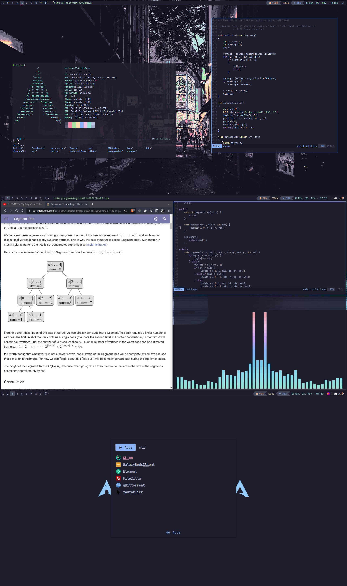
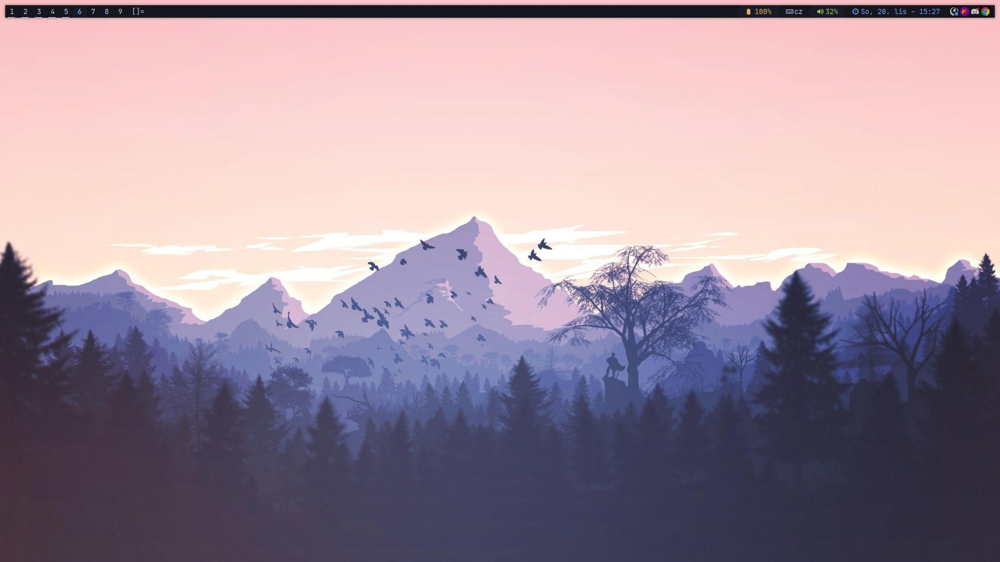
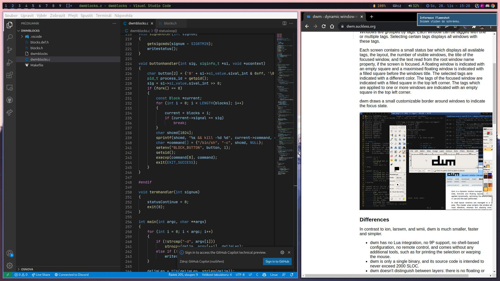
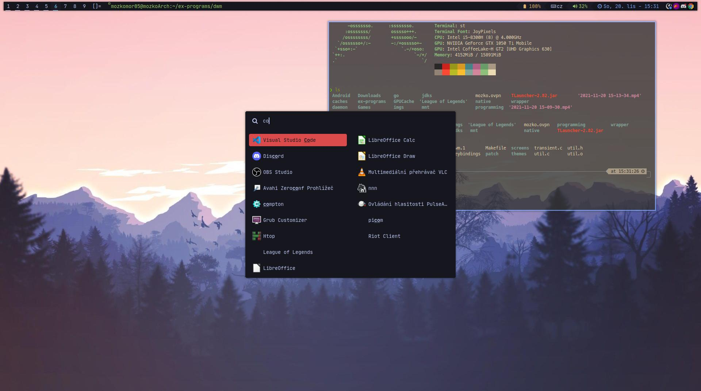

# My build of DWM
Based on https://github.com/LeD3F/dwm Tokyo theme.

## Requires
- [My custom build of dwmblocks](https://github.com/mozkomor05/dwmblocks)
- [Picom](https://github.com/yshui/picom)
- [Rofi](https://github.com/davatorium/rofi)
- [Greenclip](https://github.com/erebe/greenclip)
- pavucontrol
- [xkb-switch](https://github.com/grwlf/xkb-switch)
- [catppuccin-gtk-theme-mocha](https://github.com/catppuccin/gtk) for cattppuccin theme support
- [alacritty](https://github.com/alacritty/alacritty) although default terminal can be easily changed in `config.h`.
- *JetBrainsMono Nerd Font* and *Noto Color Emoji* although default font can be easily changed in `config.h`.

## Installation steps
1. Satisfy all dependencies.
2. Clone the repository.
```bash
git clone https://github.com/mozkomor05/dwm
```
3. Install dwm.
```bash
sudo make install
```
4. Copy `.local` and `.config` to your home directory.
```bash
cp -r .local ~/.local
cp -r .config ~/.config
```
5. Start `picom`, `dwmblocks` and `dwm`. You might add this to your `.xinitrc`:
```
dwmblocks &
picom -b
dwm
```

## Special features
- Switch between default, stack, spiral, deck, floating and more layouts.
- Systray icons
- Beautiful Catppuccin theme
- Clickable status (dwmblocks)

## Screenshots
### Catppuccin


### Tokyo



